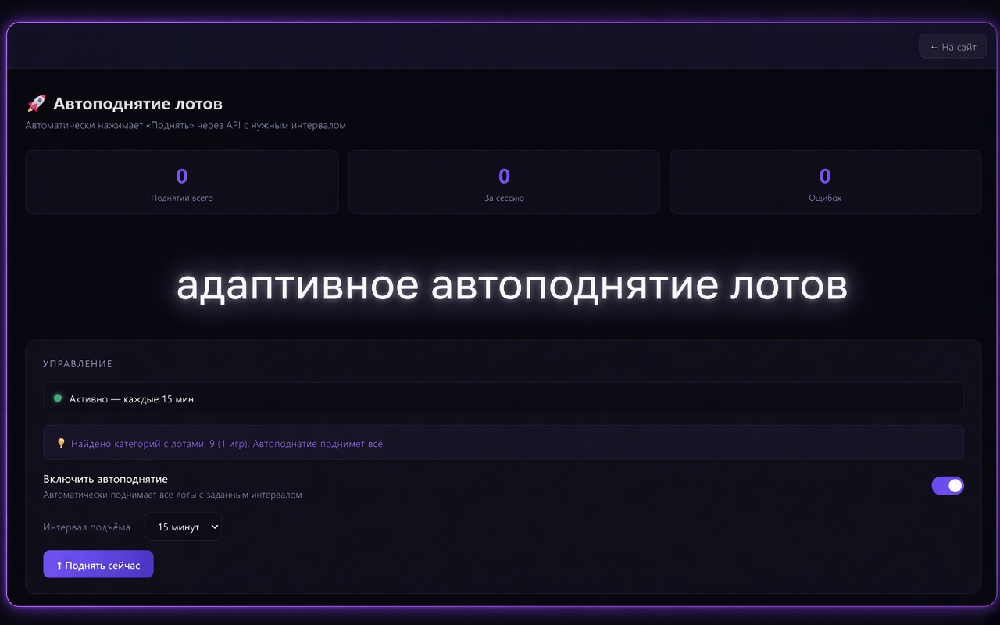
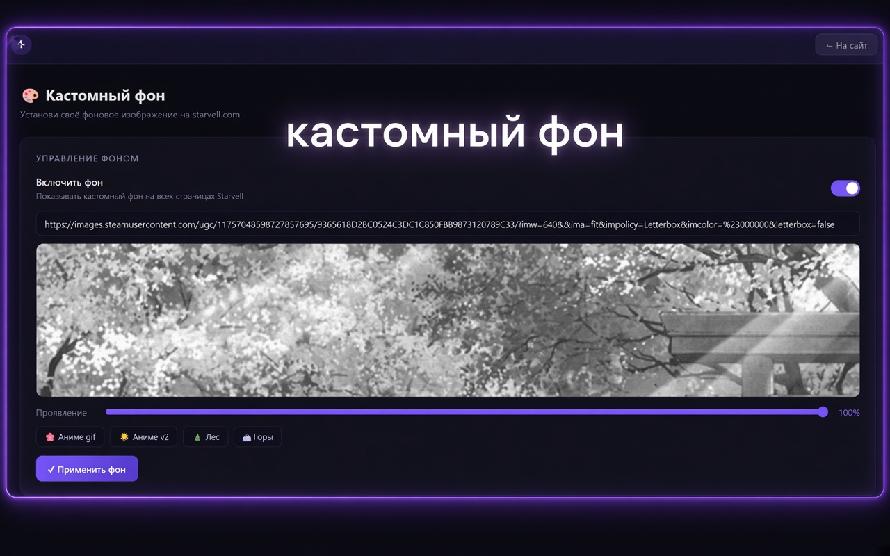
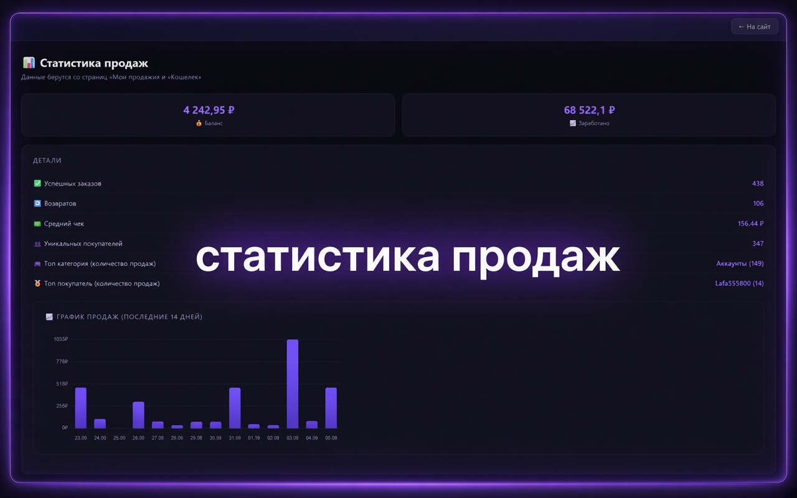
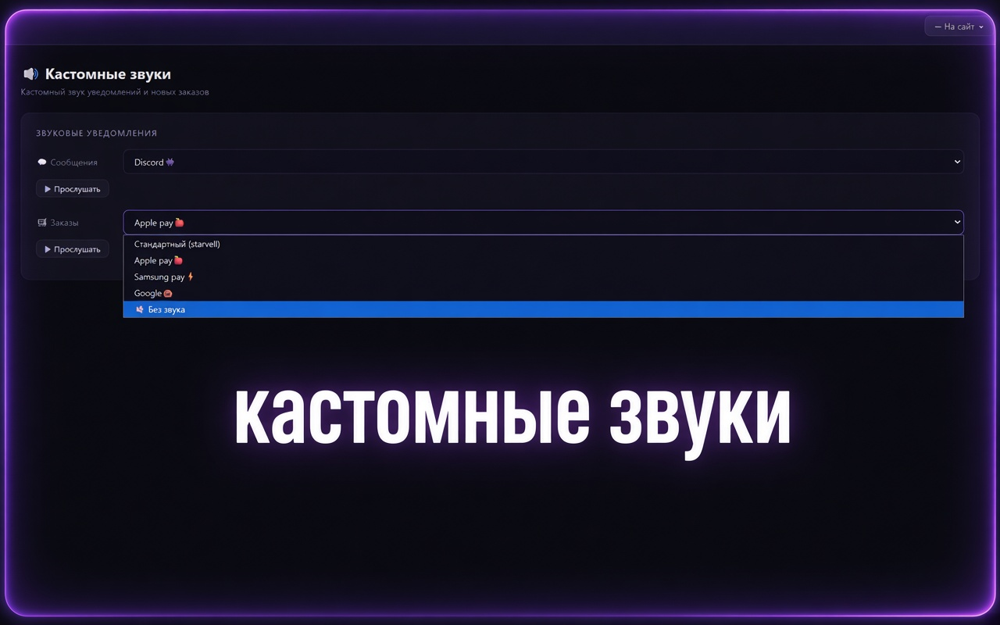
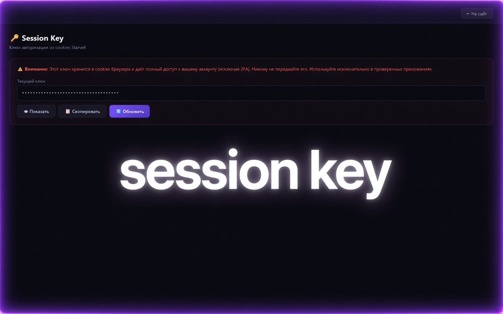

# ⭐ Starvell Helper

#### Расширение для Chrome — автоматизация для продавцов на Starvell

> Автоподнятие всех лотов, автотикеты, статистика продаж, кастомный фон, звуки, свечение и многое другое


---

## 📋 Содержание

- [⚡ Что нового в v2.1.3](#-что-нового-в-v213)
- [🚀 Возможности](#-возможности)
- [🖼️ Скриншоты](#-скриншоты)
- [⬇️ Установка](#-установка)
- [🔥 Как пользоваться](#-как-пользоваться)
- [❓ Частые вопросы](#-частые-вопросы)
- [⭐ Star it](#-star-it)

---

## ⚡ Что нового в v2.1.3

| Функция | v2.1.2 | v2.1.3 |
|---------|--------|--------|
| Автоподнятие | Ручной выбор интервала, кнопка «Поднять сейчас» | ✅ **Вкл/выкл**, адаптивный интервал, автоматическое перепланирование при 429 |
| Session Key | — | ✅ **Новое:** отображение и копирование сессионной cookie |
| Кастомные звуки | — | ✅ **Новое:** замена звуков сообщений и заказов (3 пресета + mute) |
| Свечение блоков | — | ✅ **Новое:** неоновая подсветка основных контейнеров (цвет + интенсивность) |
| Код | Один большой файл | ✅ **Разбит на модули** для лёгкой поддержки |

---

### 🚀 Адаптивное автоподнятие лотов

Расширение автоматически читает данные из вашего профиля: определяет игры (приложения) и категории с активными лотами.

- Группирует лоты по играм и отправляет **один запрос на игру**
- При успешном ответе (200) — лоты подняты, уведомление в браузере
- При ошибке 429 (Rate Limit) — автоматически забирает время ожидания из ответа сервера, переводит в минуты, добавляет +1 минуту запаса и перепланирует следующий подъём
- Управление: только **вкл/выкл** — интервал подстраивается автоматически

> ℹ️ Элементы интерфейса «Интервал подъёма» и «Поднять сейчас» сохранены в коде, но **отключены** и не влияют на работу.

---

### 🔑 Session Key

- Отображает сессионную cookie (ключ авторизации) из браузера
- Ключ даёт полный доступ к аккаунту (исключая 2FA)
- Можно скопировать одной кнопкой
- **Важно:** никому не передавайте этот ключ!

---

### 🔊 Кастомные звуки

Замените стандартные звуки Starvell на свои:

**💬 Новые сообщения:**
- Discord👾
- Telegram✈️
- Franklin GTA V🔥
- 🔇 Без звука

**🛒 Новые заказы:**
- Apple pay🍎
- Samsung pay⚡️
- Google🎃
- 🔇 Без звука

---

### ✨ Свечение блоков (GLOW)

Аккуратная неоновая подсветка основных контейнеров сайта:

- Хедер (верхняя граница)
- Профиль (баннер и верхний блок)
- Кошелёк, заказы, главные блоки
- Исключены блоки с мини-чатом и мелкие элементы (карточки, строки, кнопки)

Настраивается **цвет** и **интенсивность** свечения в интерфейсе.

---

## 🚀 Возможности

### 🚀 Автоподнятие лотов
- Автоматически читает все активные лоты из профиля
- Поднимает **все игры** — по одному запросу на игру
- **Адаптивный интервал** — система сама подбирает время с учётом cooldown
- Работает в фоне через Chrome Alarms API — даже если вкладка не активна
- Умная обработка `429 (Too Many Requests)`: перехват Retry-After, перепланирование
- Счётчики: поднятий всего / за сессию / ошибок
- Уведомления в браузере после каждого подъёма

### 🎫 Автотикеты *(бета)*
- Находит неподтверждённые заказы (статус `CREATED`) старше заданного срока
- Группирует заказы **по дню создания** — один тикет на один день
- Автоматически формирует список номеров заказов в тикете
- Настраиваемый период (3 / 7 / 14 / 30 дней)
- Ручная отправка кнопкой «Отправить тикет сейчас»
- Проверка расписания раз в сутки

### 📊 Статистика продаж
- Текущий баланс кошелька и общая сумма заработанного
- Количество успешных заказов и возвратов
- Средний чек, уникальные покупатели
- Топ категория и топ покупатель по количеству продаж
- **График продаж** за последние 14 дней с всплывающими подсказками

### 📋 Лог событий
- История всех действий расширения с временными метками
- Цветовая индикация: успех / предупреждение / ошибка
- Кнопка очистки лога

### 🔑 Session Key
- Отображение сессионной cookie
- Копирование в буфер обмена

### 🔊 Кастомные звуки
- Замена звуков новых сообщений (3 пресета + mute)
- Замена звуков новых заказов (3 пресета + mute)

### ✨ Свечение блоков
- Неоновая подсветка основных контейнеров сайта
- Настройка цвета (11 цветов) и интенсивности

### 🎨 Кастомный фон
- Устанавливает любое изображение как фон сайта по прямой ссылке (включая `.gif`)
- Предпросмотр изображения прямо в интерфейсе
- Ползунок прозрачности
- 4 встроенных пресета

### ⚙️ Настройки
- Включение/выключение уведомлений браузера
- Сброс всех сохранённых данных

---

## 🖼️ Скриншоты

**🚀 Автоподнятие лотов**  


**🎨 Кастомный фон**  


**📊 Статистика продаж**  


**🔊 Кастомные звуки**  


**🔑 Session Key**  


---

## ⬇️ Установка

### 1. Скачай расширение

Нажми **Releases → Assets → starvell-helper.zip** и распакуй в любую папку.

Или через Git:
```bash
git clone https://github.com/Hilongod/starvell-helper.git
```

### 2. Открой управление расширениями

```
chrome://extensions/
```

### 3. Включи режим разработчика

В правом верхнем углу включи тумблер **«Режим разработчика»**.

### 4. Загрузи расширение

Нажми **«Загрузить распакованное»** и выбери папку с расширением.

### 5. Готово

Кнопка **S** появится прямо в навбаре на starvell.com. Кликни по иконке расширения в Chrome — откроется полная панель инструментов.

> ⚠️ Расширение работает только в браузере Chrome

---

### 🚀 Автоподнятие лотов

1. Открой **starvell.com** и войди в аккаунт
2. Перейди в раздел **Автоподнятие**
3. Просто включи тумблер **«Включить автоподнятие»**

Всё. Расширение само найдёт все твои лоты, определит игры и категории, и будет поднимать их с адаптивным интервалом.

> ⚠️ При обнаружении cooldown (429) расширение автоматически перепланирует подъём, учитывая время ожидания от сервера. Тебе не нужно ничего настраивать.

---

### 🎫 Автотикеты *(бета)*

1. Перейди в раздел **Автотикеты**
2. Выбери период ожидания (сколько дней ждать подтверждения — по умолчанию 7)
3. Включи **«Включить автотикеты»**

Расширение раз в сутки проверит заказы и отправит тикеты по тем, что зависли. Можно отправить и вручную — кнопка **«🎫 Отправить тикет сейчас»**.

---

### 📊 Статистика продаж

Перейди в раздел **Статистика** и нажми **«🔄 Загрузить статистику»** — данные загрузятся со страниц «Мои продажи» и «Кошелёк».

---

### 🎨 Кастомный фон

1. Перейди в раздел **Кастомный фон**
2. Включи тумблер
3. Вставь прямую ссылку на изображение или выбери пресет
4. Настрой ползунок **«Проявление»**
5. Нажми **«✓ Применить фон»**

---

### 🔊 Кастомные звуки

1. Перейди в раздел **Звуки**
2. Выбери звук для сообщений и/или заказов
3. Нажми **«▶ Прослушать»** для проверки
4. Звук применится автоматически

---

### ✨ Свечение блоков

1. Перейди в раздел **Свечение**
2. Включи тумблер
3. Выбери цвет и интенсивность
4. Нажми **«✨ Применить»**

---

### 🔑 Session Key

1. Перейди в раздел **Session Key**
2. Нажми **«👁 Показать»** чтобы увидеть ключ
3. Нажми **«📋 Скопировать»** чтобы скопировать в буфер обмена

> 🔐 **Внимание:** Никому не передавайте этот ключ!

---

## ❓ Частые вопросы

**Почему Rate limit / ошибка 429?**  
Расширение само обрабатывает это: перехватывает время ожидания из ответа и перепланирует подъём. Тебе не нужно ничего менять.

**Расширение не видит мои лоты?**  
Открой свою страницу профиля и попробуй снова. Расширение читает лоты именно оттуда.

**Автотикет не отправился / «Неподтверждённых заказов нет»?**  
Значит нет заказов со статусом `CREATED` старше выбранного периода. Проверь период в настройках.

**Сайт показывает 404 при переходах?**  
Проверь другие расширения в Chrome — особенно блокировщики рекламы и антидетект. Они инжектят свой код и ломают роутинг Starvell. Отключай по одному, чтобы найти виновника.

**После перезагрузки браузера автоподнятие выключилось?**  
Включи его снова — таймер восстановится. Chrome не сохраняет состояние тумблеров между запусками.

**Фон не применяется?**  
Убедись что ты на starvell.com, обнови страницу (F5) и примени фон снова.

**Звуки не работают?**  
Проверь, что выбран не режим «Без звука» и что на странице разрешено воспроизведение звуков (в Chrome настройки сайта).

**Безопасно ли это?**  
Расширение работает только на starvell.com, не собирает данные и не отправляет ничего на сторонние серверы. Все запросы идут напрямую к API Starvell от твоего имени. Session Key отображается только тебе и хранится локально.

---

## 🧩 Баги и предложения

Вступай в чат [Telegram](https://t.me/+o7OdOQpbBtc1MThl) для связи и обсуждений.

---

## ⭐ Star it

Если расширение полезно — поставь звезду ⭐ на GitHub. Это помогает проекту развиваться!

---

## 📄 Лицензия

MIT © [Hilongod](https://github.com/Hilongod)