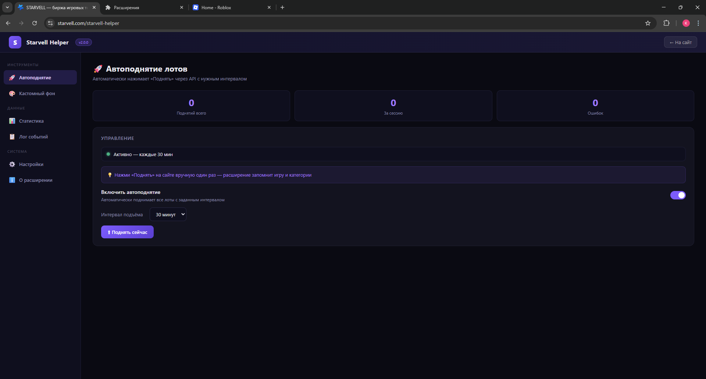
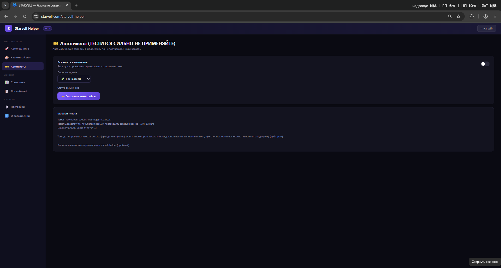
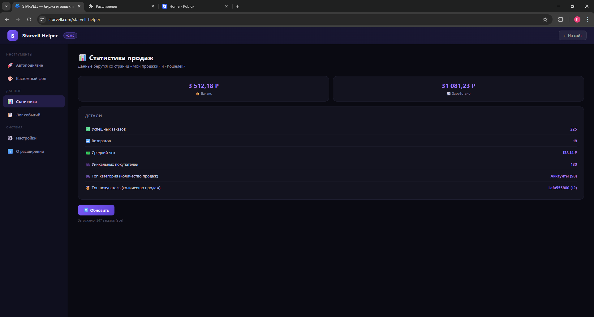
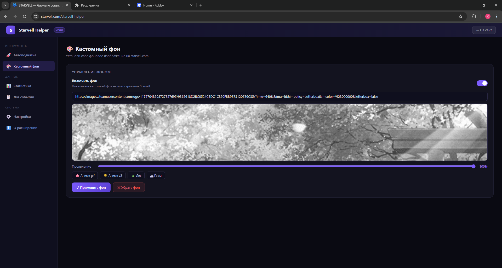
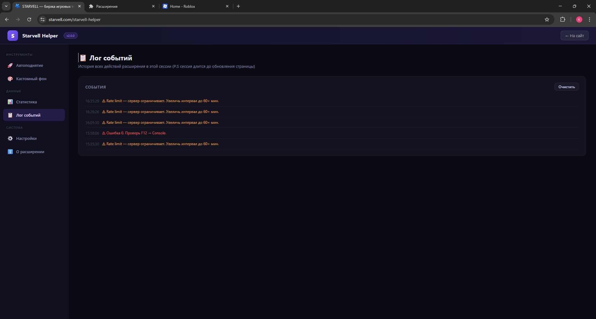

# ⭐ Starvell Helper

#### Расширение для Chrome — автоматизация для продавцов на Starvell

> Автоподнятие всех лотов, автотикеты в поддержку, статистика продаж и кастомный фон прямо на starvell.com


---

## 📋 Содержание

- [⚡ Что нового в v2.1.1](#-что-нового-в-v211)
- [🚀 Возможности](#-возможности)
- [🖼️ Скриншоты](#-скриншоты)
- [⬇️ Установка](#-установка)
- [🔥 Как пользоваться](#-как-пользоваться)
- [❓ Частые вопросы](#-частые-вопросы)
- [⭐ Star it](#-star-it)

---

## ⚡ Что нового в v2.1.1

| | v2.0 | v2.1.1 |
|---|---|---|
| Автоподнятие | Только одна игра за раз | ✅ **Все игры сразу**, автоматически |
| Источник лотов | Перехват ручного нажатия | ✅ **Читает лоты из профиля** — ручной запуск не нужен |
| Автотикеты | — | ✅ **Новое:** тикеты в поддержку по неподтверждённым заказам *(бета)* |
| Защита от 429 | — | ✅ Единое расписание, паузы между играми, защита от дублей |
| Совместимость | — | ✅ Починена работа после обновления Starvell |

### 🎫 Автотикеты (бета)

Главная фича релиза. Расширение само находит заказы, которые покупатели забыли подтвердить, и отправляет по ним тикет в поддержку.

- Находит все заказы со статусом **CREATED**, которым исполнилось N дней
- **Группирует по дню создания:** все «зависшие» заказы одного дня уходят одним тикетом списком
- Настраиваемый период ожидания (по умолчанию — 7 дней)
- Кнопка «Отправить тикет сейчас» для ручного запуска
- Работает через официальную форму поддержки Starvell

### 🚀 Автоподнятие переписано

Раньше расширение поднимало лоты только одной игры — той, что ты перехватил вручную. Теперь оно **читает все твои лоты прямо из профиля** и поднимает **каждую игру** отдельным запросом, автоматически.

- Ручное «обучение» больше не требуется
- Поднимаются все игры и все категории сразу
- Паузы между играми и обработка rate limit

---

## 🚀 Возможности

### 🚀 Автоподнятие лотов
- Автоматически читает все активные лоты из твоего профиля
- Поднимает **все игры** — по одному запросу на игру, как это делает сайт
- Настраиваемый интервал: от 5 минут до 2 часов
- Работает в фоне через Chrome Alarms API — даже если вкладка не активна
- Умная обработка `429 (Too Many Requests)`: пауза и повтор
- Счётчики: поднятий всего / за сессию / ошибок
- Уведомления в браузере после каждого подъёма

### 🎫 Автотикеты *(бета)*
- Находит неподтверждённые заказы (статус `CREATED`) старше заданного срока
- Группирует заказы **по дню создания** — один тикет на один день
- Автоматически формирует список номеров заказов в тикете
- Настраиваемый период (3 / 7 / 14 / 30 дней)
- Ручная отправка кнопкой «Отправить тикет сейчас»
- Проверка расписания раз в сутки

### 📊 Статистика продаж
- Текущий баланс кошелька и общая сумма заработанного
- Количество успешных заказов и возвратов
- Средний чек, уникальные покупатели
- Топ категория и топ покупатель по количеству продаж

### 📋 Лог событий
- История всех действий расширения с временными метками
- Цветовая индикация: успех / предупреждение / ошибка
- Кнопка очистки лога

### 🎨 Кастомный фон
- Устанавливает любое изображение как фон сайта по прямой ссылке (включая `.gif`)
- Предпросмотр изображения прямо в интерфейсе
- Ползунок прозрачности
- 4 встроенных пресета (Аниме gif, Аниме v2, Лес, Горы)
- Фон не ломает вёрстку сайта

### ⚙️ Настройки
- Включение/выключение уведомлений браузера
- Сброс всех сохранённых данных

---

## 🖼️ Скриншоты

**Автоподнятие лотов**


**Автотикеты**


**Статистика продаж**


**Кастомный фон**


**Лог событий**


---

## ⬇️ Установка

### 1. Скачай расширение

Нажми **Releases → Assets → starvell-helper.zip** и распакуй в любую папку.

Или через Git:
```bash
git clone https://github.com/Hilongod/starvell-helper.git
```

### 2. Открой управление расширениями

```
chrome://extensions/
```

### 3. Включи режим разработчика

В правом верхнем углу включи тумблер **«Режим разработчика»**.

### 4. Загрузи расширение

Нажми **«Загрузить распакованное»** и выбери папку с расширением.

### 5. Готово

Кнопка **S** появится прямо в навбаре на starvell.com. Кликни по иконке расширения в Chrome — откроется полная панель инструментов.

> ⚠️ Расширение работает только в браузере Chrome

---

## 🔥 Как пользоваться

### Открытие панели

- **Кнопка S в навбаре** — быстрый доступ прямо на сайте
- **Иконка расширения** в Chrome — открывает `starvell.com/starvell-helper` с полным интерфейсом

### Автоподнятие лотов

1. Открой **starvell.com** и войди в аккаунт
2. Перейди в раздел **Автоподнятие**
3. Выбери интервал и включи **«Включить автоподнятие»**

Всё. Расширение само найдёт все твои лоты и будет поднимать каждую игру по расписанию.

> ⚠️ Starvell разрешает поднятие раз в **2+ часа**. Рекомендуемый интервал — **60 минут**. При более частых запросах сервер вернёт `429` — расширение подождёт и повторит.

> 💡 В v2.1.1 ручное нажатие «Поднять» для обучения больше **не требуется** — лоты читаются напрямую из профиля.

### Автотикеты *(бета)*

1. Перейди в раздел **Автотикеты**
2. Выбери период ожидания (сколько дней ждать подтверждения — по умолчанию 7)
3. Включи **«Включить автотикеты»**

Расширение раз в сутки проверит заказы и отправит тикеты по тем, что зависли. Можно отправить и вручную — кнопка **«🎫 Отправить тикет сейчас»**.

**Как группируются заказы:** все неподтверждённые заказы **одного дня**, которым исполнилось N дней, уходят **одним тикетом** — списком номеров. Заказы другого дня — отдельным тикетом.

> ⚠️ **Бета-функция.** Первый раз запусти вручную и проверь результат в разделе [«Мои тикеты»](https://starvell.com/support/tickets) перед включением автоматики.

### Статистика продаж

Перейди в раздел **Статистика** и нажми **«Обновить»** — данные загрузятся со страниц «Мои продажи» и «Кошелёк».

### Кастомный фон

1. Перейди в раздел **Кастомный фон**
2. Включи тумблер
3. Вставь прямую ссылку на изображение или выбери пресет
4. Настрой ползунок **«Проявление»**
5. Нажми **«✓ Применить фон»**

---

## ❓ Частые вопросы

**Почему Rate limit / ошибка 429?**
Время с последнего подъёма ещё не вышло. Увеличь интервал до 60+ минут — расширение повторит попытку автоматически. Также закрой лишние вкладки Starvell.

**Расширение не видит мои лоты?**
Открой свою страницу профиля и попробуй снова. Расширение читает лоты именно оттуда.

**Автотикет не отправился / «Неподтверждённых заказов нет»?**
Значит нет заказов со статусом `CREATED` старше выбранного периода. Проверь период в настройках — возможно, он слишком большой.

**Сайт показывает 404 при переходах?**
Проверь другие расширения в Chrome — особенно блокировщики рекламы и антидетект. Они инжектят свой код и ломают роутинг Starvell. Отключай по одному, чтобы найти виновника.

**После перезагрузки браузера автоподнятие выключилось?**
Включи его снова — таймер восстановится. Chrome не сохраняет состояние тумблеров между запусками.

**Фон не применяется?**
Убедись что ты на starvell.com, обнови страницу (F5) и примени фон снова.

**Безопасно ли это?**
Расширение работает только на starvell.com, не собирает данные и не отправляет ничего на сторонние серверы. Все запросы идут напрямую к API Starvell от твоего имени.

---

## 🧩 Баги и предложения

Вступай в чат [Telegram](https://t.me/+o7OdOQpbBtc1MThl) для связи и обсуждений.

---

## ⭐ Star it

Если расширение полезно — поставь звезду ⭐ на GitHub. Это помогает проекту развиваться!

---

## 📄 Лицензия

MIT © [Hilongod](https://github.com/Hilongod)
